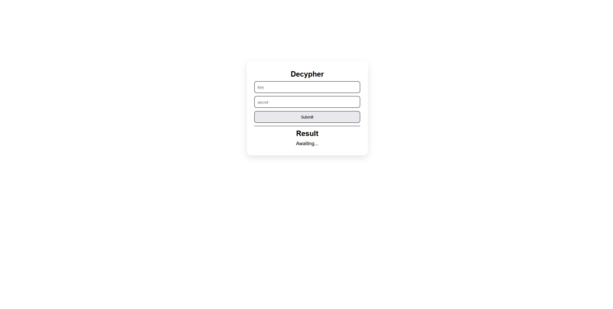
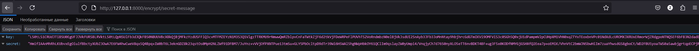
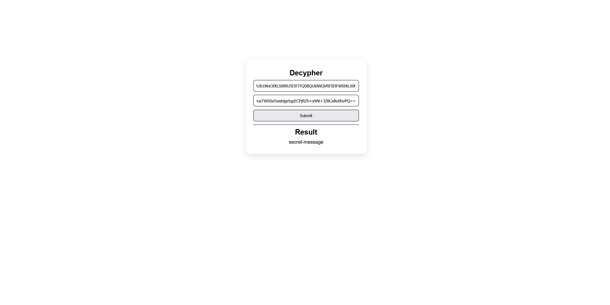

# Decypher task
## FastApi + pycryptodome  

Позволяет зашифровать сообщение по маршруту `/encode/{message}`. Имея два ключа можно выполнить POST запрос к /decypher или же воспользоваться формой, которая находиться в корне ( маршурт `/`).  

## Демонстрация работы  

  
 ---
  
 ---
  
---
