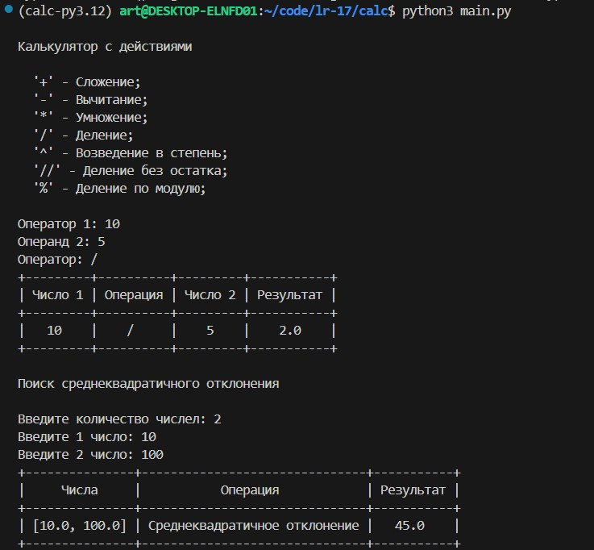
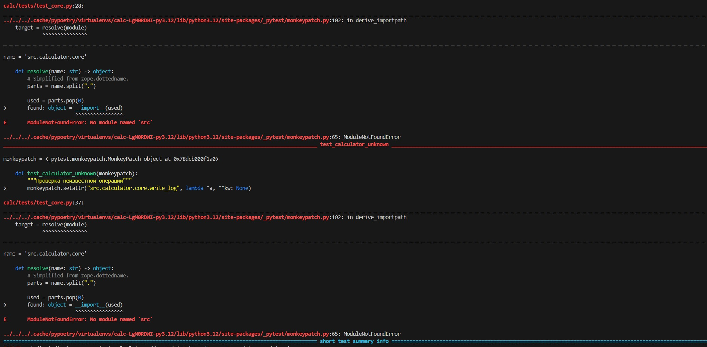
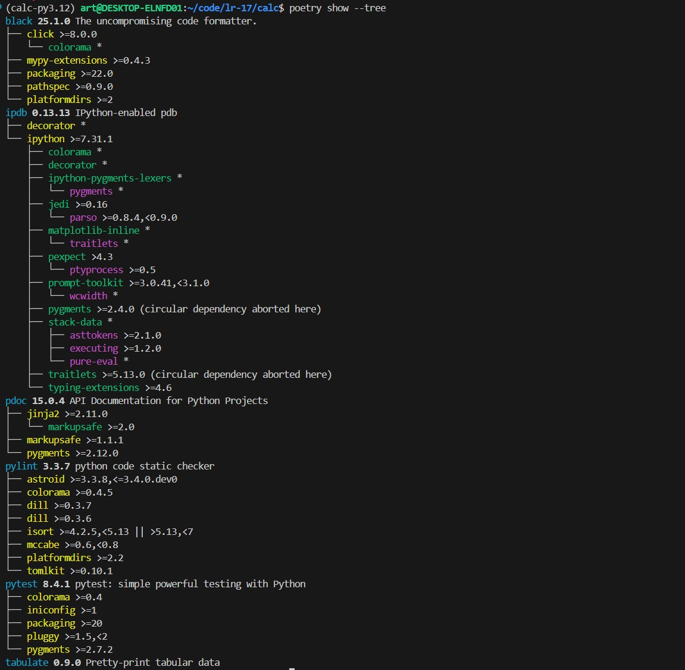
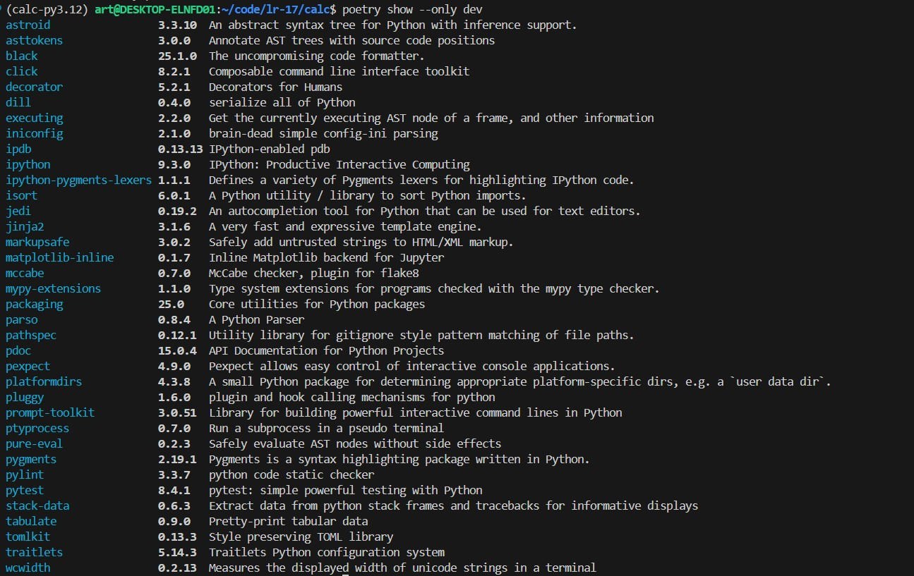
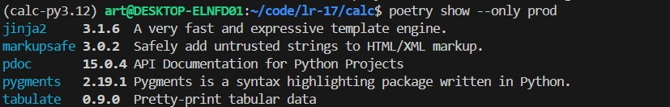

# ОТЧЁТ

## pyproject.toml  

```toml
[project]
name = "calc"
version = "0.1.0"
description = "smth"
authors = [
    {name = "Name",email = "you@example.com"}
]
license = {text = "MIT"}
readme = "README.md"
requires-python = ">=3.11"
dependencies = [
    "tabulate"
]

[build-system]
requires = ["poetry-core>=2.0.0,<3.0.0"]
build-backend = "poetry.core.masonry.api"

[tool.poetry.group.dev.dependencies]
pytest = "^8.4.1"
black = "^25.1.0"
pylint = "^3.3.7"
ipdb = "^0.13.13"
tabulate = "^0.9.0"
pdoc = "^15.0.4"

[tool.poetry.group.prod.dependencies]
pdoc = "^15.0.4"
tabulate = "^0.9.0"

[tool.pytest.ini_options]
pythonpath = ["src"]
```

## Запуск калькулятора в prod среде / pytest в dev среде  
### Калькулятор
  

---

### Pytest  
  

---


## Деревья зависимости  

### Полное
  

### Dev


### Prod  
  

Можем наблюдать, как количество зависимостей уменьшается при смене среды dev на prod (Убираем утилиты для разработки)